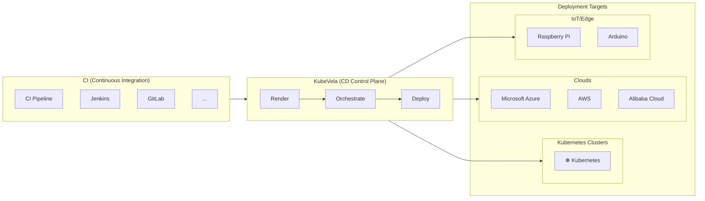

# KubeVela Architecture Diagram

This Mermaid diagram shows how KubeVela fits into a modern CI/CD pipeline as the continuous delivery (CD) control plane.

## How it works

1. **CI tools** (Jenkins, GitLab, etc.) build, test, and package your application.

2. **KubeVela** acts as the CD control plane with three stages:
   - **Render**: Transforms application definitions into deployable artifacts
   - **Orchestrate**: Coordinates workflow, policies, and multi-cluster strategies
   - **Deploy**: Pushes the application to target environments

3. **Deployment targets** include:
   - Kubernetes clusters
   - Cloud providers (Azure, AWS, Alibaba Cloud, etc.)
   - IoT/Edge devices (Raspberry Pi, Arduino, etc.)
